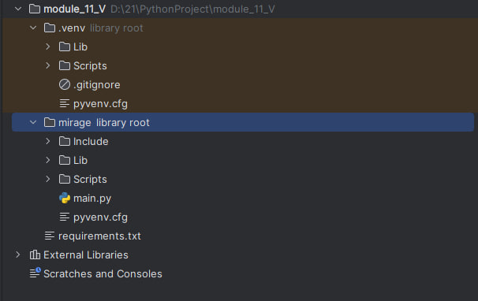
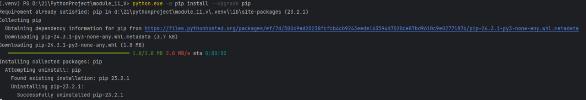
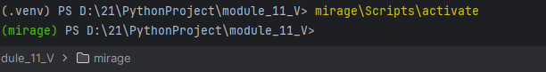
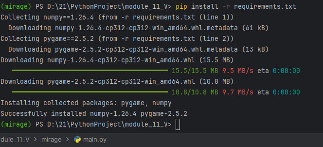
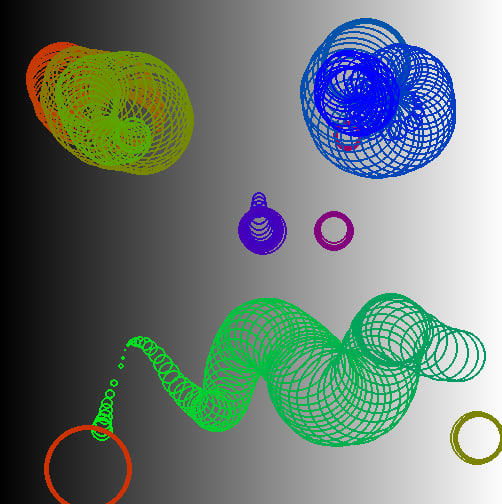

# Выполнение задания: 

_Скриншоты древа проекта (развернутое). Должно присутствовать 2 окружения ('venv', 'ваше название')_

_Скриншот(-ы) с вызовами соответствующих pip - команд при выполнении ДЗ._

_Рисунок получившийся у вас._